# Active Directory Home Lab: Domain Deployment and Management (Windows Server 2022)

## Project Description

This repository presents the documentation regarding the configuration of an Active Directory (AD) environment in a controlled and isolated laboratory setting, with the purpose of understanding the fundamental concepts of domain management, centralized authentication, and Group Policy Objects (GPO).

The laboratory consisted of a Domain Controller (Windows Server 2022) and a client (Windows 10 Pro), interconnected in an isolated network configured through VirtualBox. The following activities were performed: installation and configuration of AD DS and DNS, creation of domain users, configuration of Remote Desktop access, joining the client to the domain, and application of password policies via Group Policy.

The documentation includes environment setup, commands used, evidence of the tests (screenshots), as well as analyses and best practices for Active Directory domain administration.

>⚠️ Disclaimer: All procedures, commands, and configurations presented in this repository were performed in an isolated virtual lab environment and are intended solely for educational and training purposes. The configurations demonstrated are simplified examples and should not be considered production-ready or a substitute for proper security assessments in real-world environments.

## Tools and Technologies Used

Below are the main technologies and tools employed in the laboratory.

| Tool / Technology                     | Main Function        | Use in the Laboratory |
|--------------------------------------|---------------------|----------------------|
| VirtualBox                           | Virtualization      | Virtualization platform used to create and manage the lab VMs (Windows Server 2022 and Windows 10). Supports internal networks and snapshots. |
| Windows Server 2022                  | Domain Controller   | Server operating system hosting Active Directory Domain Services (AD DS) and DNS. |
| Windows 10 Pro                       | Domain Client       | Workstation that joins the domain and authenticates using Active Directory users. |
| Active Directory Domain Services (AD DS) | Directory Service   | Centrally manages users, computers, and security policies. |
| DNS Server                           | Name Resolution     | Allows clients to locate the Domain Controller through the domain name. |
| Group Policy Management (GPMC)       | Policy Management   | Applies security configurations (e.g., password policy) to domain users and computers. |

## Official Download Links

| Tool / Technology   | Version | Link |
|--------------------|--------|------|
| VirtualBox         | 7.0+   | [virtualbox.org](https://www.virtualbox.org/)|
| Windows Server 2022 | 2022  | [Microsoft Evaluation Center](https://www.microsoft.com/en-us/evalcenter/evaluate-windows-server-2022)|
| Windows 10 Pro     | 22H2   | [Microsoft Software Download](https://www.microsoft.com/en-us/software-download/windows10)|

> Note: The evaluations of Windows Server 2022 and Windows 10 Pro are free and work for 180 days, which is sufficient for educational purposes.

## Environment Setup

### Installation of VirtualBox, Creation of VMs (Windows Server 2022 and Windows 10), and Internal Network Preparation

This section presents the procedures and parameters adopted for configuring the virtual environment used in the laboratory.

Below are reproducible instructions that allow creating a laboratory similar to the one used in this project, with Windows Server 2022 (Domain Controller), Windows 10 Pro (client), and a dedicated internal network.

### A. Install VirtualBox

1. Access the official VirtualBox website.
2. Download the installer appropriate for your system (Windows / macOS / Linux).
3. Run the installer by double-clicking the downloaded file. Then, follow the wizard instructions and accept the installation of network drivers when prompted.
4. Finish and, if prompted, restart your computer.
5. Open VirtualBox and confirm the interface.

<div align="right"> <details> <summary font-weight: bold;> [VirtualBox Interface] </summary> 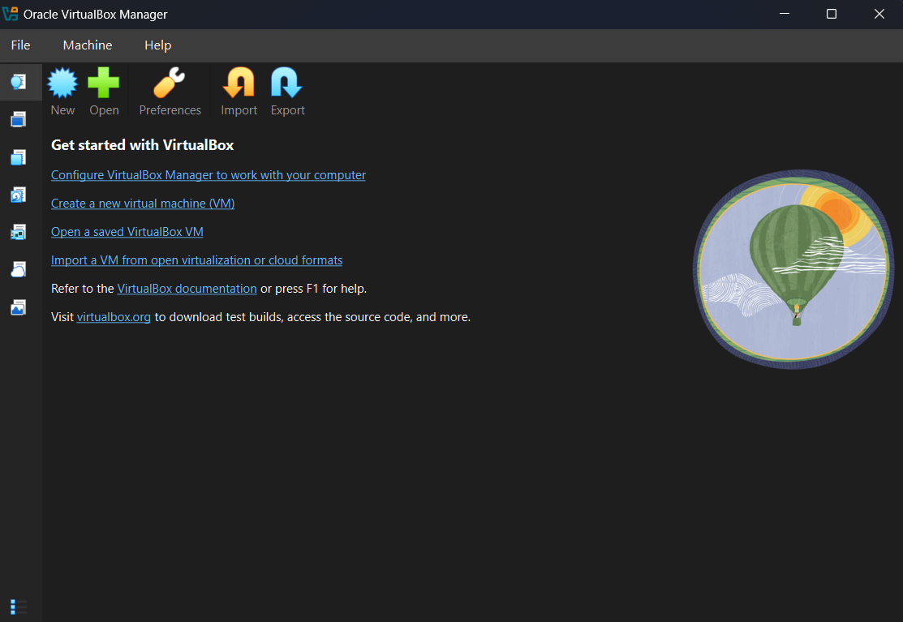 </details> </div>

### B. Create the Windows Server 2022 VM

1. Access the Microsoft website and download the Windows Server 2022 ISO (180-day evaluation).
2. In VirtualBox, click New.
3. VM Name: `LAB-DC01` → Folder: select your desired folder → ISO Image: click the dropdown and select Choose a disk file... → browse and select the Windows Server 2022 ISO you downloaded → Next →

<div align="right"> <details> <summary font-weight: bold;> [Windows Server 2022 VM Configuration] </summary> 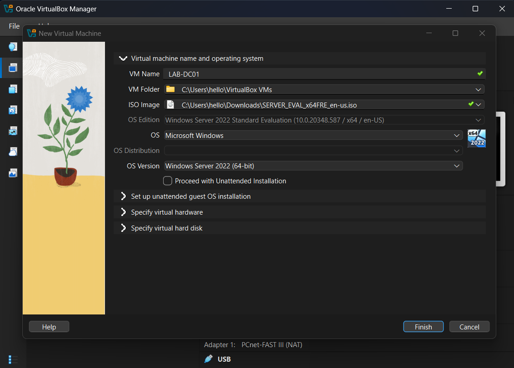 </details> </div>

4. Unattended Guest OS Setup: UNCHECK "Proceed with Unattended Installation" (this disables the buggy auto-setup) → Next →
5. Hardware:
- Base Memory: 4096 MB (2 GB)
- Processors: 2

<div align="right"> <details> <summary font-weight: bold;> [Windows Server VM Hardware] </summary> 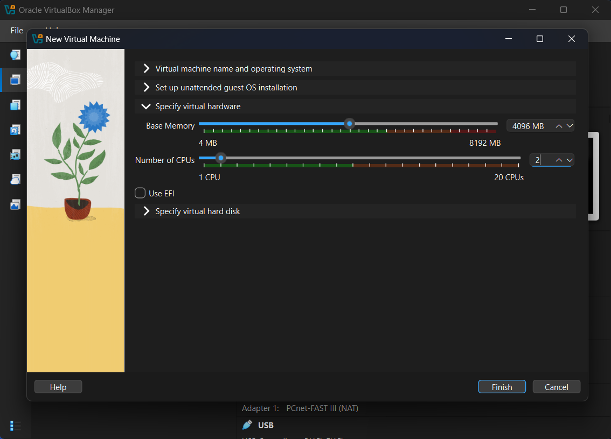 </details> </div>

6. Virtual Hard Disk:
- Disk Size: 50 GB

<div align="right"> <details> <summary font-weight: bold;> [Windows Server VM Hard Disk] </summary> 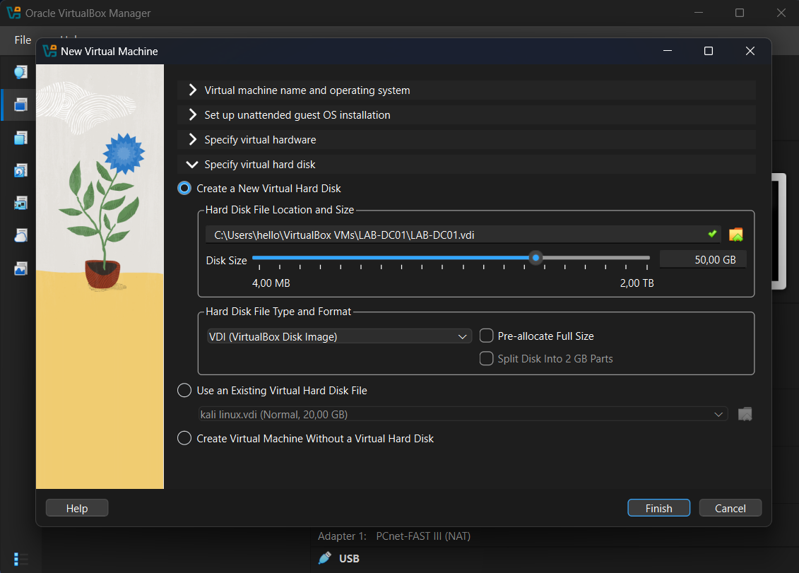 </details> </div>

7. Click Finish to create the VM.

### C. Create the Windows 10 Pro VM

1. Download the Windows 10 Pro ISO (Pro edition is required to join the domain).
2. In VirtualBox, click New.
3. VM Name: `CLIENT01` → Folder: select your desired folder → ISO Image: click the dropdown and select Choose a disk file... → browse and select the Windows 10 ISO you downloaded → Next →

<div align="right"> <details> <summary font-weight: bold;> [Windows 10 VM Configuration] </summary> 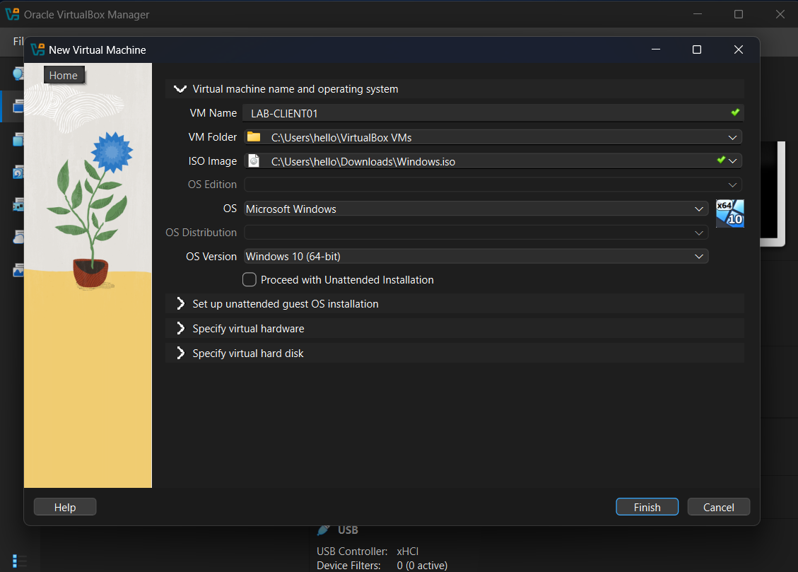 </details> </div>

4. Unattended Guest OS Setup: UNCHECK "Proceed with Unattended Installation" → Next →
5. Hardware:
- Base Memory: 4096 MB (4 GB)
- Processors: 2 → Next →
6. Virtual Hard Disk:
- Disk Size: 50 GB → Finish
- Click Finish to create the VM.

### D. Internal Network Configuration

1. For each VM (Windows Server 2022 and Windows 10):
2. Select the VM → Settings → Network.
3. Under Adapter 1, make sure Enable Network Adapter is checked.
4. Under Attached to, choose Internal Network.
5. In the Name field, type `AD-Lab-Network` (use the same name for both VMs).

<div align="right"> <details> <summary font-weight: bold;> [Internal Network Configuration] </summary> 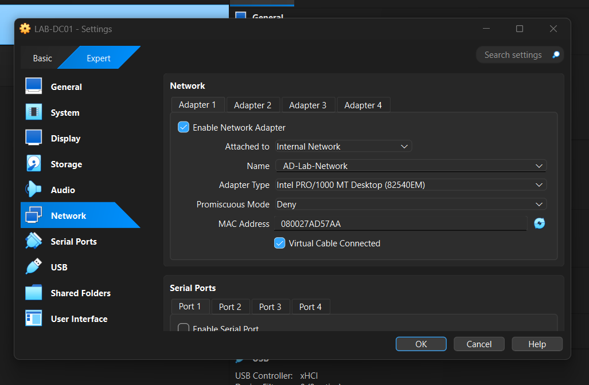 </details> </div>

6. Save the settings.

> Why Internal Network? This configuration completely isolates the laboratory from your home network and the internet, ensuring a controlled, secure, and predictable environment for learning.

### E. Complete the OS Installation (if needed)
Since you attached the ISO during VM creation, the installation will begin automatically when you start each VM.

Windows Server 2022
1. Select the `DC01` VM and click Start.
2. The Windows Server 2022 installer will load. Follow the prompts.
3. When asked, choose Desktop Experience (not Core).

<div align="right"> <details> <summary font-weight: bold;> [Windows Server 2022 Installation] </summary> 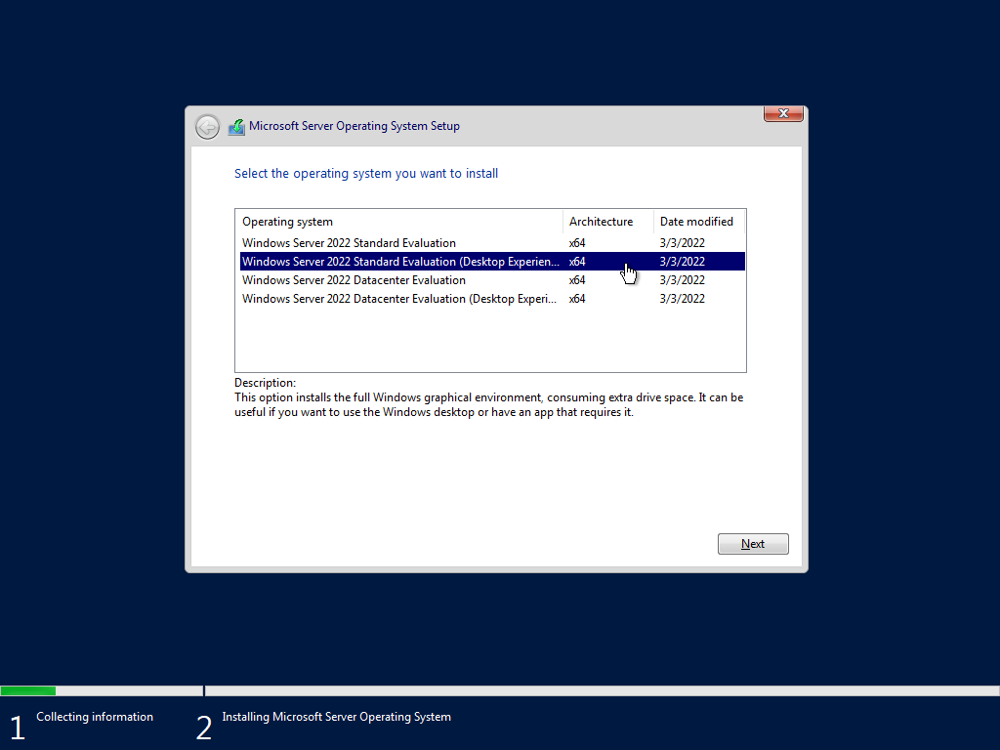 </details> </div>

4. Set the Administrator password when prompted.

Windows 10 Pro
1. Select the `CLIENT01` VM and click Start.
2. The Windows 10 installer will load. Follow the prompts.

<div align="right"> <details> <summary font-weight: bold;> [Windows 10 Pro Installation] </summary> 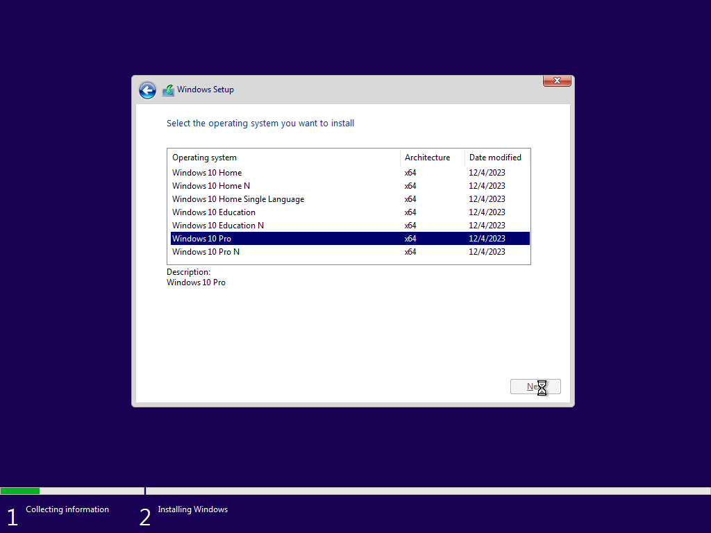 </details> </div>

> ⚠️ Important: You MUST select Windows 10 Pro during installation. The Pro edition is required to join a domain. Windows 10 Home does NOT support domain membership.

### F. Configure IP Addresses
When you set the network adapter to Internal Network and start the VM for the first time, Windows will try to find a DHCP server to automatically assign an IP address. Since there is no DHCP server on an Internal Network, Windows will eventually give up and assign itself an APIPA address.

You can see this by opening Command Prompt and typing ipconfig. You will likely see an IP address in the range 169.254.x.x (for example, 169.254.101.98).

<div align="right"> <details> <summary font-weight: bold;> [APIPA Address on Windows Server] </summary> 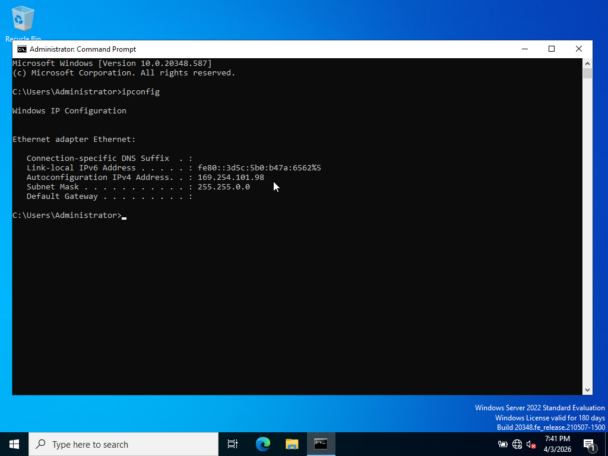 </details> </div>

> What is APIPA? APIPA stands for Automatic Private IP Addressing. It is a feature in Windows that automatically assigns an IP address from the range 169.254.0.1 to 169.254.255.254 when no DHCP server is available. APIPA allows computers on the same network segment to communicate with each other without any manual configuration. However, APIPA addresses are unpredictable and can change after a reboot. For a lab environment where our server needs to be found at a consistent address by the client, this is a problem.

Windows Server 2022 (DC01)
1. Log into the server as Administrator.
2. Open Control Panel → Network and Internet  → Network and Sharing Center → Change adapter settings.
3. Right-click the network adapter → Properties.
4. Select Internet Protocol Version 4 (TCP/IPv4) → Properties.
5. Select Use the following IP address and fill in:

| Field               | Value           |
|---------------------|-----------------|
| IP address          | 192.168.100.10  |
| Subnet mask         | 255.255.255.0   |
| Default gateway     | (leave blank)   |
| Preferred DNS server| 127.0.0.1       |

<div align="right"> <details> <summary font-weight: bold;> [Windows Server IP Configuration] </summary> 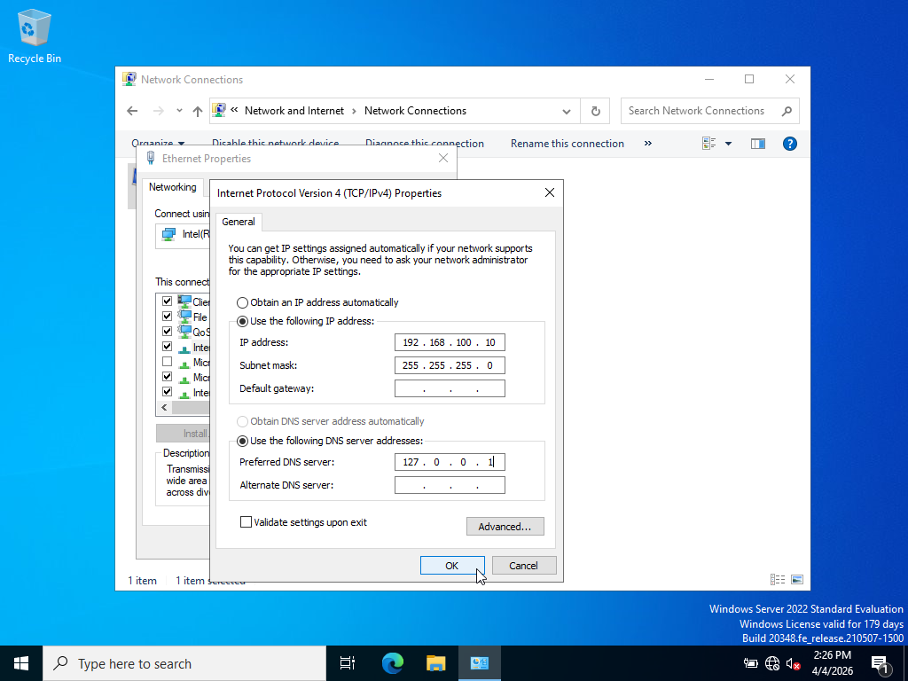 </details> </div>

6. Click OK twice.

Windows 10 Pro (CLIENT01)
1. Log into the client.
2. Repeat the steps above, but use:

| Field               | Value           |
|---------------------|-----------------|
| IP address          | 192.168.100.20  |
| Subnet mask         | 255.255.255.0   |
| Default gateway     | (leave blank)   |
| Preferred DNS server| 192.168.100.10  |

<div align="right"> <details> <summary font-weight: bold;> [Windows 10 IP Configuration] </summary> 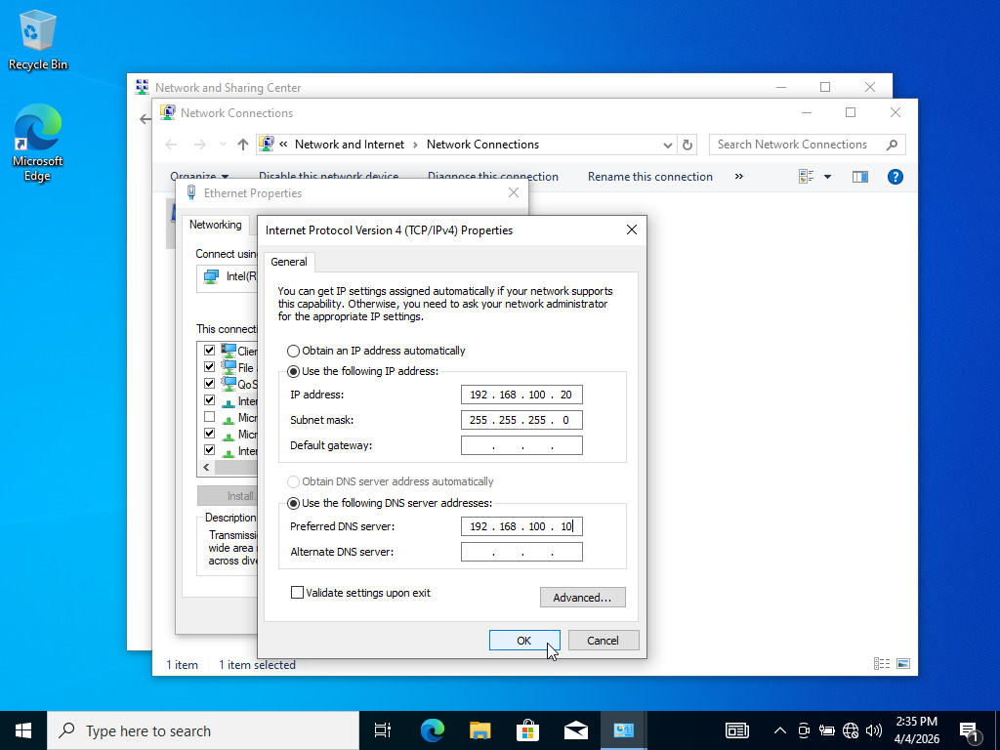 </details> </div>

### G. Validate Connectivity

Ping test from client to server

On CLIENT01, open Command Prompt and run:

```Bash 
ping 192.168.100.10
```

The expected result is 4 successful replies.

<div align="right"> <details> <summary font-weight: bold;> [Ping Test] </summary> 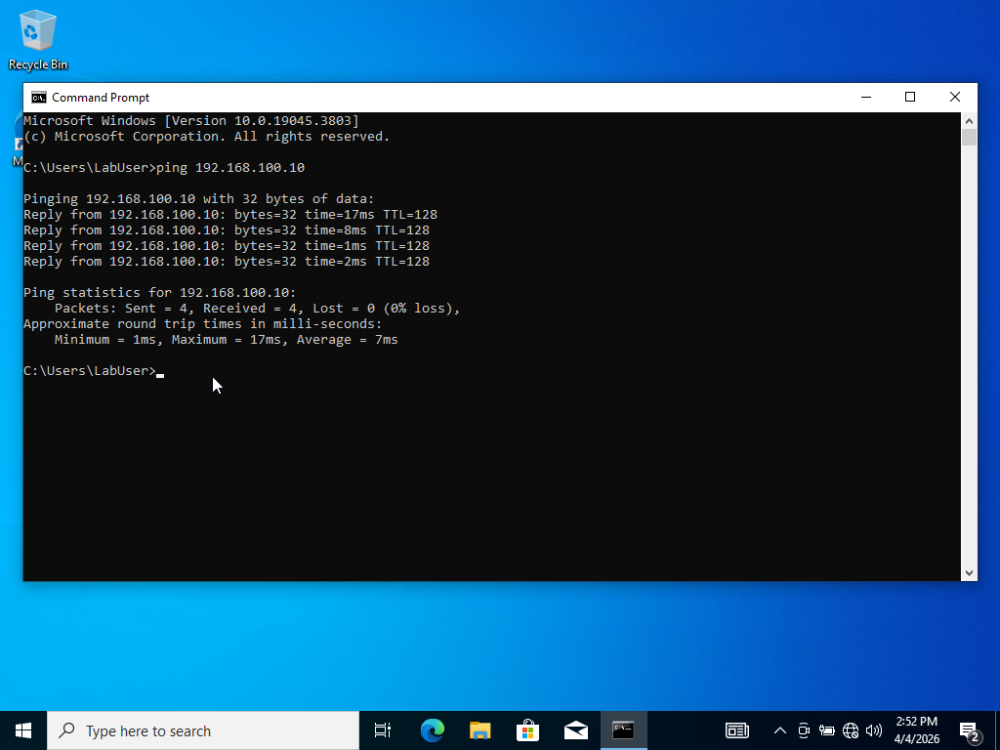 </details> </div>

> If the ping fails (you see a "Request timed out"), this is normal because Windows Firewall on the server blocks ICMP (ping) by default. Follow the steps below to enable ping on the server.

### How to Allow Ping on Windows Server (Enable ICMP)

On DC01 (Windows Server):

1. Open Control Panel → System and Security → Windows Defender Firewall → Advanced settings.
2. Click Inbound Rules on the left.
3. Scroll down to find File and Printer Sharing (Echo Request - ICMPv4-In).
4. Select the rule → on the right, Enable Rule.

<div align="right"> <details> <summary font-weight: bold;> [Enable ICMP in Windows Firewall] </summary> 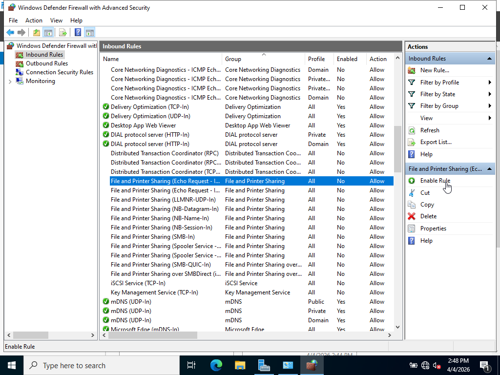 </details> </div>

After enabling ICMP, go back to `CLIENT01` and run the ping command again. You should now see 4 successful replies.

## Active Directory Configuration Procedures
### A. Rename the Server
1. On DC01, open Server Manager.
2. Click Local Server in the left menu.
3. Click the blue link next to Computer name.
4. Click Change... → under Computer name, type `DC01` → OK.
5. Click Restart Now to reboot the server.

<div align="right"> <details> <summary font-weight: bold;> [Renaming the Server] </summary> 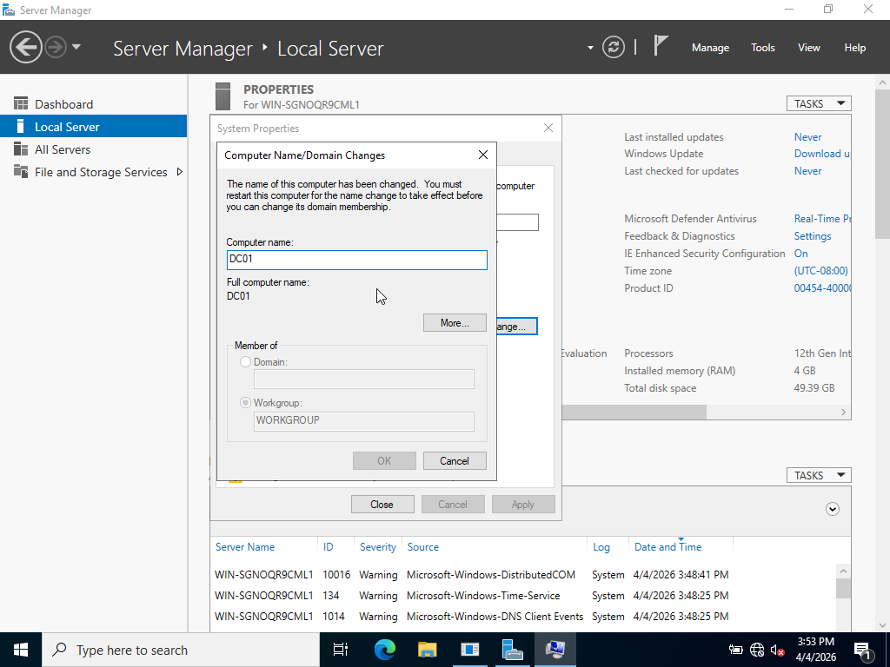 </details> </div>

### B. Install Active Directory Domain Services (AD DS) and DNS
1. Log back into DC01.
2. In Server Manager, click Manage → Add Roles and Features.
3. Click Next until you reach Server Roles.
4. Check Active Directory Domain Services → click Add Features.
5. Check DNS Server → click Add Features.
6. Click Next until Confirmation → click Install.

<div align="right"> <details> <summary font-weight: bold;> [AD DS and DNS Installation] </summary> 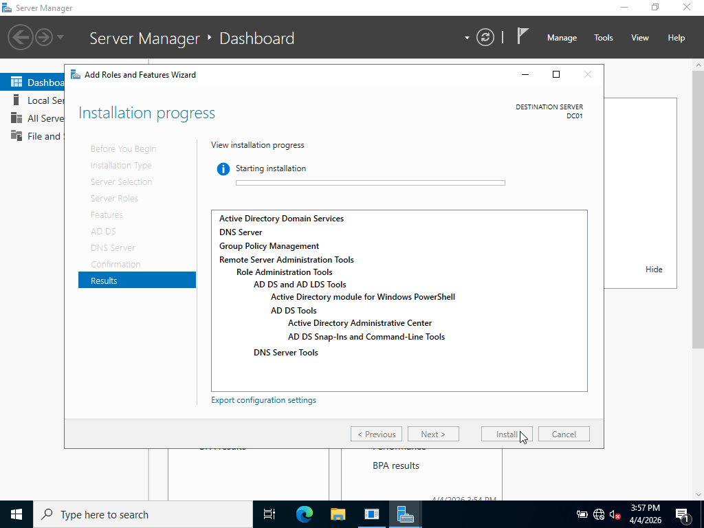 </details> </div>

**FIGURE 1: AD DS and DNS installation confirmation screen.**

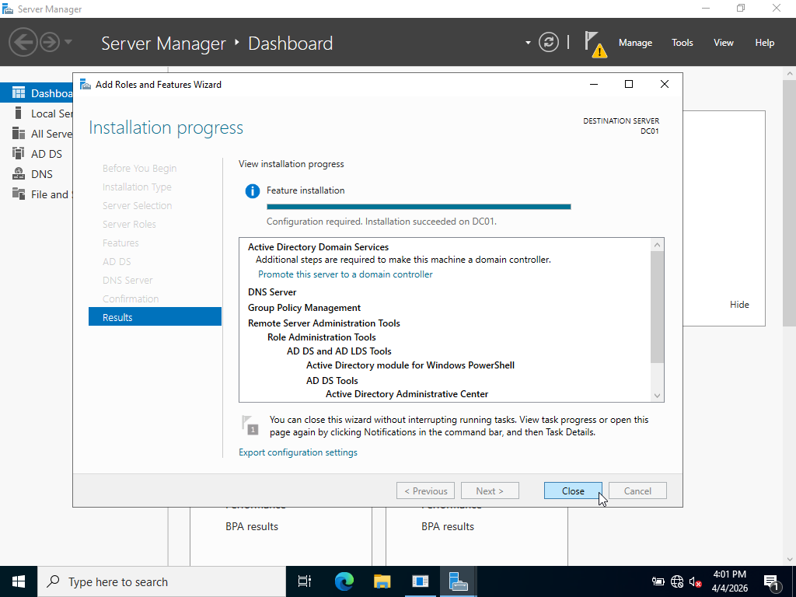

### C. Promote the Server to a Domain Controller
1. After installation, click the yellow flag (⚠️) at the top of Server Manager → Promote this server to a domain controller.

<div align="right"> <details> <summary font-weight: bold;> [Promote to Domain Controller] </summary> 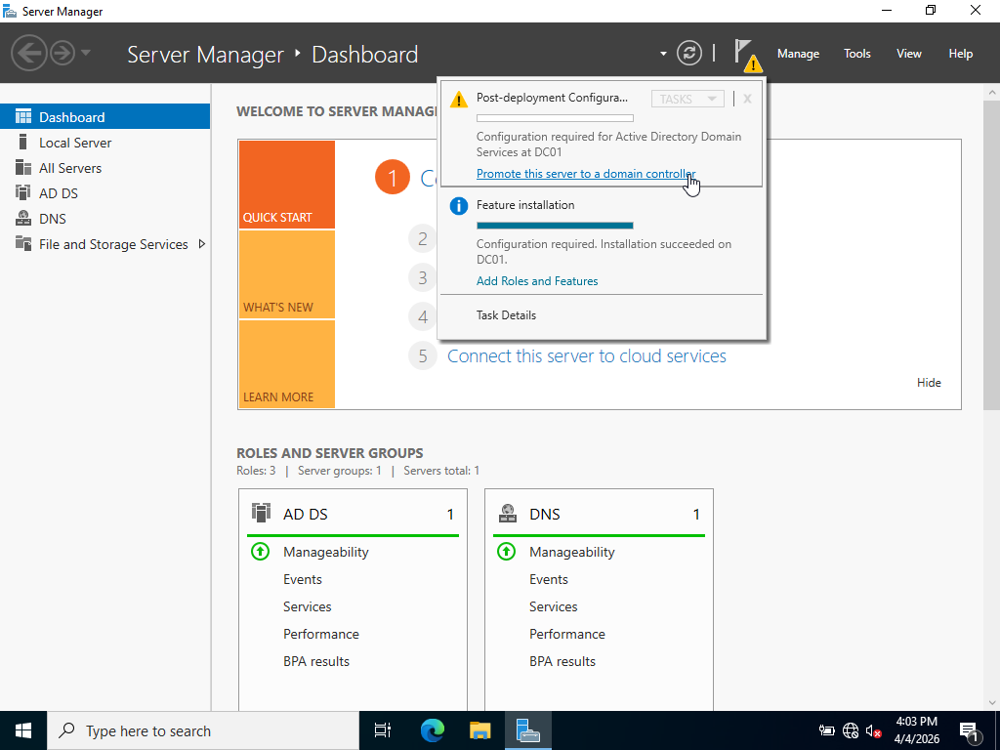 </details> </div>

2. Select Add a new forest.
3. Next Root domain name, type something like `labcorp.local` → Next.

<div align="right"> <details> <summary font-weight: bold;> [Creating New Forest] </summary> 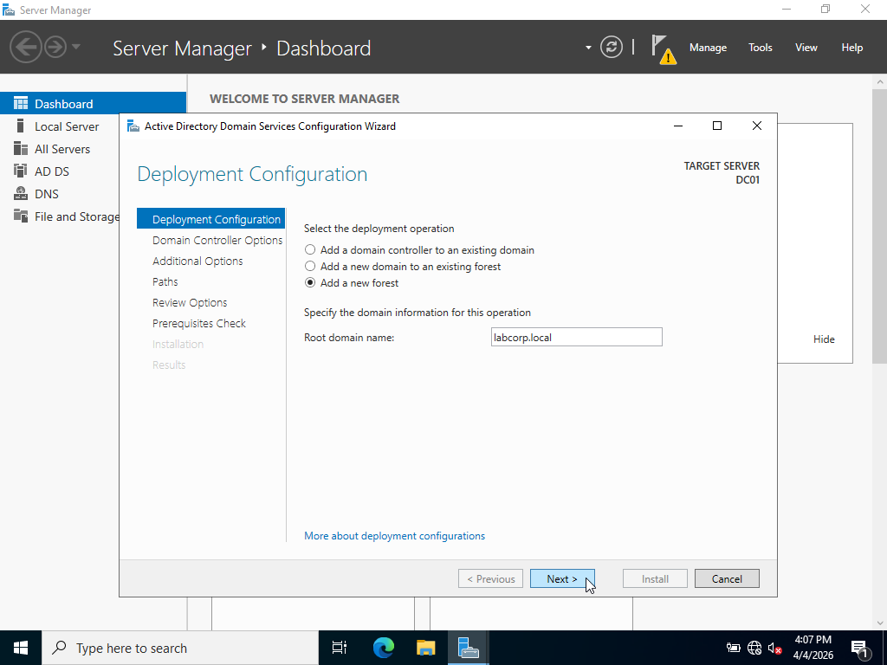 </details> </div>

4. Set the DSRM password → Next.
5. Verify the NetBIOS name `LABCORP` → Next 3 times.
6. Click Install (the server will restart automatically).

### D. Create a Domain User
1. Log in as LABCORP\Administrator.
2. Open Server Manager → Tools → Active Directory Users and Computers.
3. Expand labcorp.local → right-click Users → New → User.

<div align="right"> <details> <summary font-weight: bold;> [Creating New User] </summary> 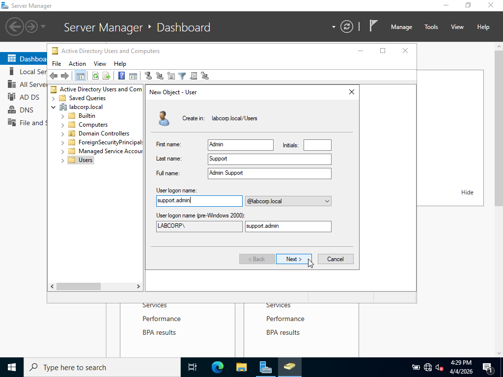 </details> </div>

4. Fill in:

- First name: Admin
- Last name: Support
- User logon name: support.admin

> Note: This is just an example used for demonstration purposes, and do not need to be followed strictly.

5. Click Next.
6. Set the User password.  
7. In lab environments, options such as "User must change password at next logon" can be unchecked and "Password never expires" can be enabled to simplify user management and avoid interruptions during testing.
8. Click Next → Finish.

**FIGURE 2: User Admin created in Active Directory Users and Computers.**

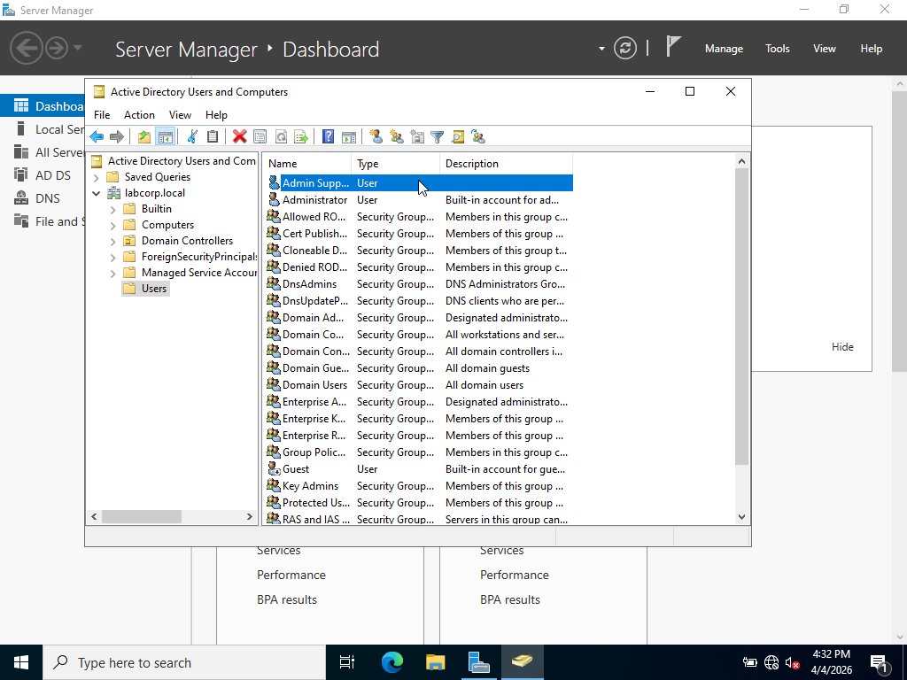

### E. Add the User to the Remote Desktop Users Group

1. Right-click the user Admin Support → Properties.
2. Member Of tab → Add.
3. Type `Remote Desktop Users` → Check Names → OK.

Click Apply → OK.

<div align="right"> <details> <summary font-weight: bold;> [Adding to Remote Desktop Users Group] </summary> 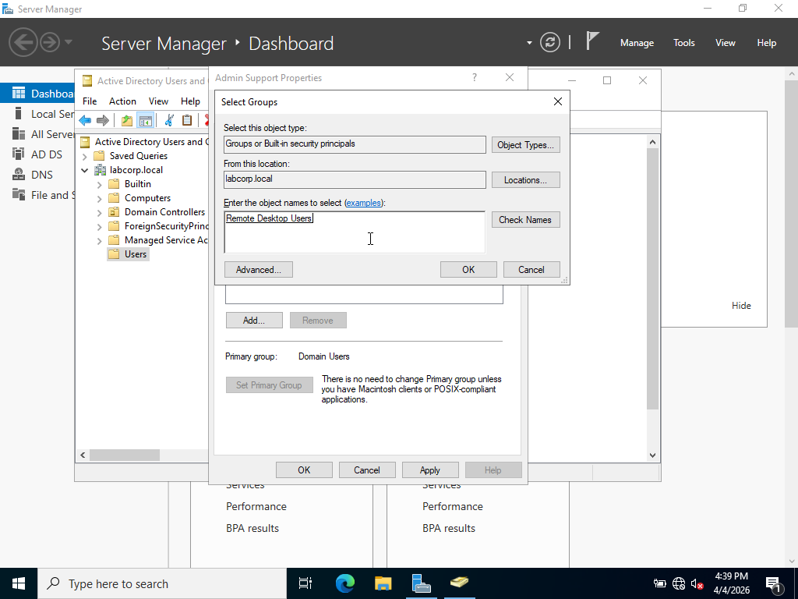 </details> </div>

**FIGURE 3: User properties showing Remote Desktop Users group.**

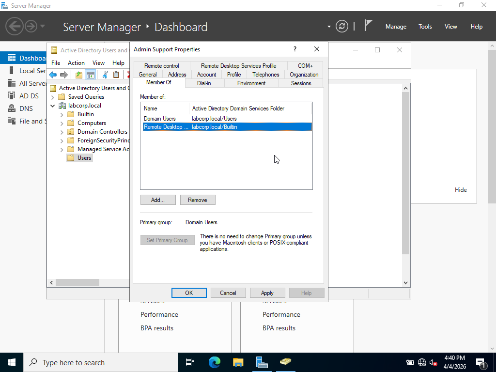

### F. Join the Client to the Domain

1. On CLIENT01, open Control Panel → System and Security → System → Change settings.
2. Computer Name tab → click Change.
3. Select Domain → type `labcorp.local` → OK.

<div align="right"> <details> <summary font-weight: bold;> [Joining the Domain] </summary> 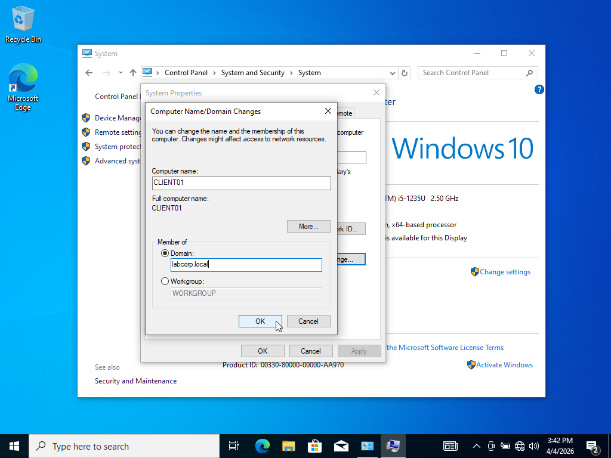 </details> </div>

4. When prompted, enter:

- Username: support.admin
- Password: yourpassword

5. Click OK → restart the computer when prompted.

### G. Log into the Client as a Domain User

1. After reboot, click Other user.
2. Enter:

- Username: LABCORP\support.admin
- Password: yourpassword

<div align="right"> <details> <summary font-weight: bold;> [Domain User Login] </summary> 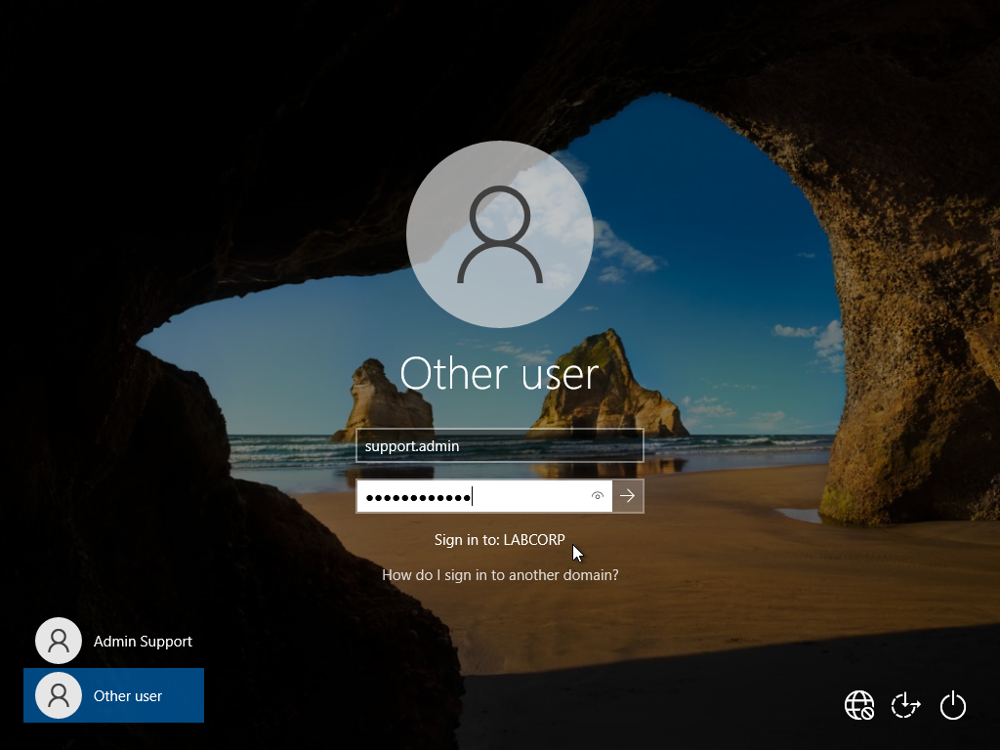 </details> </div>

3. After logging in, open Command Prompt and type whoami to confirm.

**FIGURE 4: Windows 10 desktop with whoami showing labcorp\support.admin.**

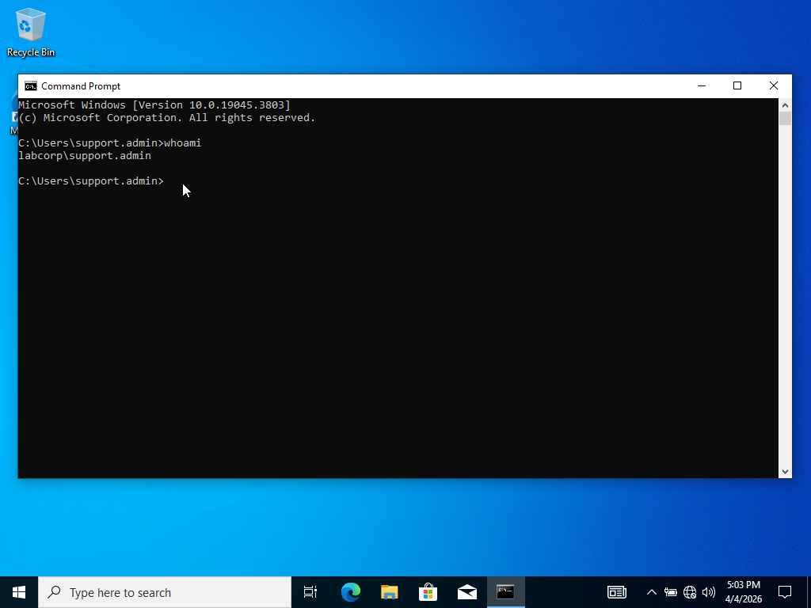
